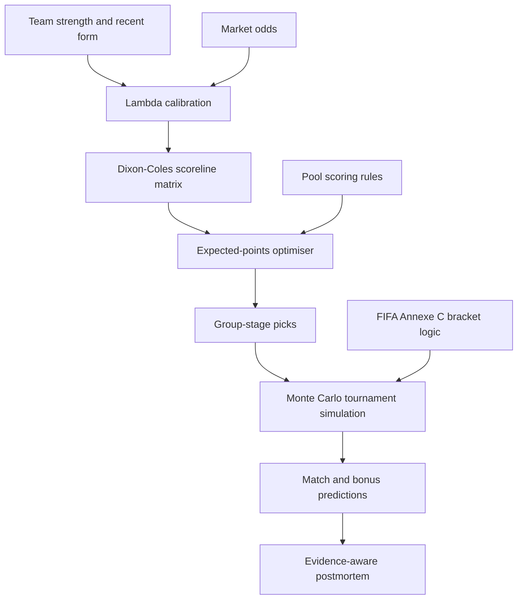

# FIFA World Cup 2026 Prediction-Pool Optimiser

A portfolio-safe implementation of a probabilistic football prediction system built for a recreational FIFA World Cup 2026 pool. The project combines scoreline modelling, market calibration, expected-points optimisation, tournament simulation, and a provenance-aware postmortem.

> **Portfolio note:** this repository contains sample inputs and sanitised analytical outputs. Private credentials, personal communications, and raw provenance evidence are deliberately excluded.

## What the system does



## Highlights

- **Expected-points optimisation:** evaluates candidate scorelines against the pool's actual payoff function rather than selecting the modal score by default.
- **Probabilistic score modelling:** combines Elo-informed scoring rates, Poisson scorelines, and a Dixon-Coles adjustment for low-scoring outcomes.
- **Market integration:** ingests and quality-checks 1X2 and Over/Under odds, including overround, coverage, freshness, and cross-bookmaker dispersion controls.
- **Tournament simulation:** runs 100,000 Monte Carlo iterations across the expanded 48-team format.
- **Official bracket logic:** implements the 495 Annexe C combinations governing the allocation of the best third-placed teams.
- **Transparent fallbacks:** records when market inputs are unavailable or rejected and the model falls back to its internal prior.
- **Forensic postmortem:** separates fully verified pipelines, externally corroborated outputs, and decisions without sufficient prospective evidence.

## Postmortem results

The public postmortem evaluates only prospectively corroborated group-stage outputs:

| Evidence tier | Decisions | Interpretation |
|---|---:|---|
| **Tier A** | 0 | Output, inputs, and their binding were independently verified |
| **Tier B** | 75 | Output was corroborated before kick-off; inputs were not independently verified |
| **Tier C** | 69 | No sufficient external temporal corroboration |

For the 71 Tier B Classic Pool decisions, the model recorded:

- **60.6%** 1X2 accuracy;
- **12.7%** exact-score accuracy;
- **104 points from 284 available**;
- **+10 observed points** from expected-points optimisation relative to the modal score, with a 95% bootstrap interval of **[-22, +42]**.

The full evidence boundaries, uncertainty, and prohibited interpretations are documented in the [group-stage postmortem](postmortem/README.md).

## Repository structure

| Path | Purpose |
|---|---|
| `src/` | Core modelling, optimisation, ingestion, and simulation code |
| `config/` | Tournament, scoring-rule, source, and team-alias configuration |
| `scripts/` | Audits, Annexe C utilities, and pre-submission checks |
| `data/sample/` | Portfolio-safe sample inputs |
| `outputs/sample/` | Illustrative sample outputs |
| `tests/` | Scoring-rule regression tests |
| `postmortem/` | Sanitised portfolio report, figures, and provenance manifests |

## Running the project

```bash
python -m venv .venv

# Windows
.venv\Scripts\activate

# macOS or Linux
source .venv/bin/activate

pip install -r requirements.txt
python -m pytest
python -m src.pipeline.run_all
```

Live market ingestion requires `THE_ODDS_API_KEY`. Copy `.env.example` to `.env` and provide your own key. Never commit credentials. Humanity has already invented enough ways to leak secrets without assistance from a football model.

## Language standard

Human-facing documentation and messages use **standard New Zealand English**. Stable code identifiers, historical artefact paths, external schema fields, and the repository URL retain their established spelling where changing them would break compatibility or provenance links.

## Limitations

- This is an educational and recreational modelling project, not a betting product or source of financial advice.
- Public sample data are intentionally incomplete and do not reproduce the private operational run byte for byte.
- The postmortem verifies a subset of outputs, not the complete historical input pipeline.
- The full 1X2 probability vectors were not retained in the verified output, so Log Loss, RPS, and 1X2 Brier Score are not reported.
- Results from one tournament should not be generalised to future competitions without further validation.

## Licence

No explicit open-source licence has been granted unless a licence file is present. Please contact the repository owner before reusing substantial portions of the project.
