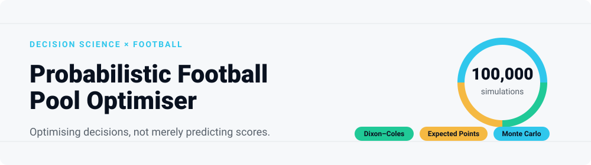
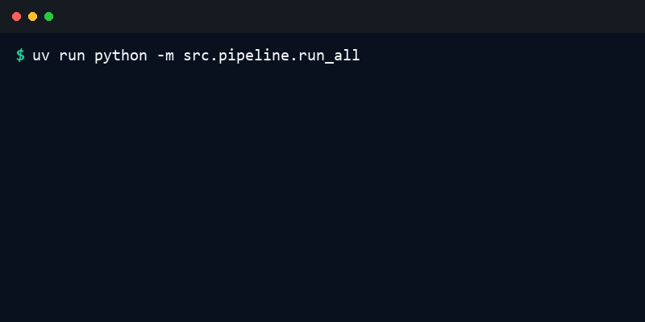

<picture>
  <source media="(prefers-color-scheme: dark)" srcset="assets/hero-dark.svg">
  <source media="(prefers-color-scheme: light)" srcset="assets/hero-light.svg">
  
</picture>

> A reproducible decision-science system that combines football probability models, tournament simulation and scoring-rule optimisation to choose the highest-value pool predictions.

<br>

| Simulations | 1X2 Accuracy | EP Uplift | Corroborated Outputs |
|:---:|:---:|:---:|:---:|
| **100,000** | **60.6%** | **+10 pts** | **75** |
*Note: Tier B postmortem results. Optimisation uplift was directional but statistically inconclusive.*

<p align="center">
  <a href="#4-results"><b>View the Results</b></a> &nbsp;&bull;&nbsp;
  <a href="#6-quick-start"><b>Run the Optimiser</b></a> &nbsp;&bull;&nbsp;
  <a href="postmortem/README.md"><b>Read the Postmortem</b></a>
</p>

---

## 1. The Decision Problem

The most probable scoreline is not always the best pool pick. Different scoring rules reward different decisions, so this project maximises **expected points (EP)** rather than blindly selecting the modal outcome. 

When a pool assigns asymmetric payoffs to exact scores versus simple outcome predictions (1X2), betting strictly on the most likely outcome can leave points on the table.

## 2. What Makes It Different

* **Probability model:** Dixon–Coles-adjusted score matrices.
* **Decision layer:** Expected-points optimisation under custom scoring rules.
* **Tournament layer:** Deterministic 100,000-run Monte Carlo simulation.
* **Audit layer:** Prospective evidence classification and post-tournament scoring.

## 3. Visual Walkthrough

```text
MARKET + FORM
      ↓
PROBABILITY ENGINE
Dixon–Coles score matrix
      ↓
DECISION ENGINE
Expected-points optimiser
      ↓
TOURNAMENT ENGINE
100,000 simulations
      ↓
AUDIT & POSTMORTEM
Evidence tiers + realised performance
```

## 4. Results

| Question | Observed result | Interpretation |
|---|---:|---|
| Did it predict the correct 1X2 outcome? | **60.6%** | 43/71 Tier B classic decisions |
| Did it predict exact scores? | **12.7%** | 9/71 |
| Did EP optimisation outperform the modal pick? | **+10 points** | Directional; CI included zero |
| Did the four verified 50-35-20 flips add value? | **+15 points** | Selected cases; not generalisable |

> *These results evaluate prospectively corroborated outputs, not a fully verified historical pipeline.*

## 5. Interactive Demo



## 6. Quick Start

Ensure you have [uv](https://github.com/astral-sh/uv) installed, then run:

```bash
git clone https://github.com/guilobocm/probabilistic-football-pool-optimiser.git
cd probabilistic-football-pool-optimiser
uv sync --locked
uv run python -m src.pipeline.run_all
```

## 7. Explore the Outputs

The pipeline generates three files in `outputs/`:

1. **`match_picks.csv`**: The optimal picks for every group stage match under the chosen scoring rule.
2. **`simulation_summary.json`**: Probabilities for teams advancing, reaching the semi-finals, or winning the tournament.
3. **`bonus_picks.json`**: The highest EP answers for common tournament-wide bonus questions.

## 8. Engineering Quality

- [x] Deterministic simulation
- [x] Fixed random seed
- [x] Locked dependencies
- [x] Unit and end-to-end smoke tests
- [x] Public schema validation
- [x] Sanitised static postmortem

To run the full suite of validations (lint, formatting, type checking, tests, demo, and manifest integrity):

```bash
# Requires a Bash environment (Git Bash, WSL, Linux, or macOS)
bash scripts/validate.sh
```

> **Note for Windows users:** If you are using PowerShell, `validate.sh` will not run natively. You can either use Git Bash/WSL, or run the steps manually as defined in the script (e.g., `uv run pytest`, `uv run ruff check .`, etc.).

## 9. Forensic Postmortem

**The model was not simply evaluated. Its predictions were forensically audited.**

We classify the evidence for every prediction into strict tiers before scoring it:
* **Tier A:** 0 decisions (Full pipeline verifiable)
* **Tier B:** 75 decisions (Prospective output corroborated by platform metadata)
* **Tier C:** 69 decisions (Unverified)

Read the full investigation in the [Postmortem Package](postmortem/README.md).

## 10. Limitations

* No full historical input verification.
* No complete probability vectors in the verified output.
* Limited Tier B sample size.
* Static public postmortem package.
* No claim of generalisation to future tournaments.

## 11. Project Structure

```text
.
├── assets/                  # Visual assets for documentation
├── config/                  # Pipeline and scoring configuration
├── data/                    # Historical and tournament data
├── outputs/                 # Sample model outputs
├── postmortem/              # Static reports and forensic audit
├── scripts/                 # Utility scripts
├── src/                     # Core optimisation and simulation logic
└── tests/                   # Smoke tests and schema validation
```
