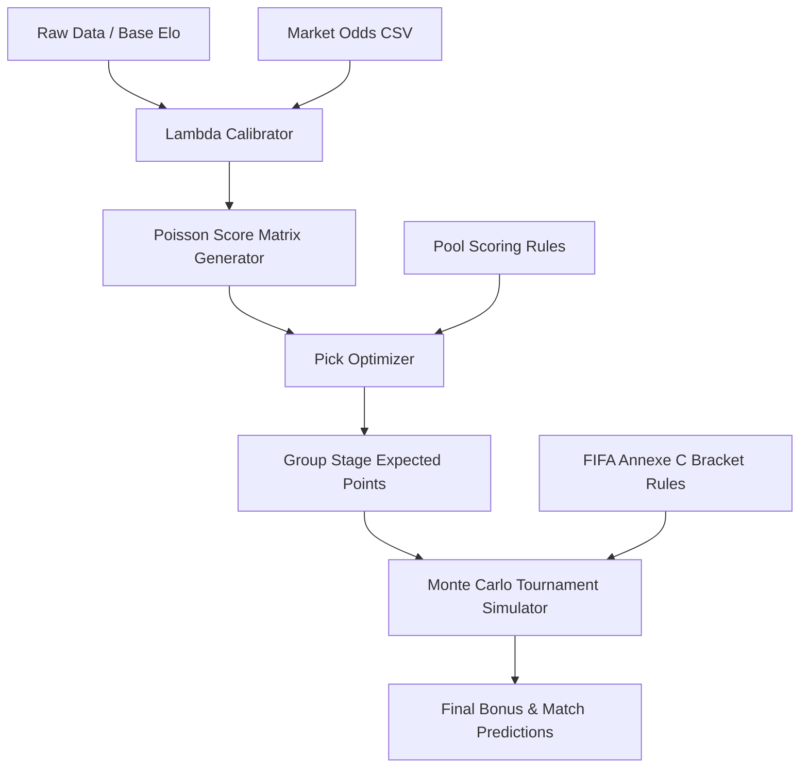

# World Cup 2026 Pool Optimizer

This repository is a portfolio-safe version of a probabilistic optimizer for a recreational FIFA World Cup 2026 prediction pool. It focuses on expected-points maximization, simulation, auditability, and clean data engineering practices.

## Architecture & Data Flow

## Key Features
- **Expected Points Optimization:** Evaluates scorelines not just by raw probability, but by the mathematical Expected Points (EP) payout according to custom pool scoring rules.
- **Scoreline Probability Matrices:** Uses a bivariate Poisson model with Dixon-Coles correction to generate full 9x9 match outcome matrices.
- **Monte Carlo Simulation:** Simulates the entire World Cup 100,000 times to accurately price long-term outcomes (e.g. Champion, Top Scorer Team).
- **FIFA 2026 Bracket Logic:** Fully implements the official 48-team bracket format, including the 495 combinations of best third-placed teams advancing to the Round of 32 (Annexe C).
- **Auditability & Fallbacks:** Generates pre-submission checklists, audit logs for total goals calibration, and explicit fallbacks when market data is unavailable or rejected due to high overround.

## Limitations & Disclaimer
- **Educational Only:** This is not a betting system. It does not provide financial advice and cannot guarantee predictions in real-world scenarios.
- **Sample Data:** This public repository contains truncated sample data (`data/sample/`, `outputs/sample/`) to demonstrate functionality without exposing proprietary API structures or operational artifacts.
- **Simulated Outcomes:** Outputs shown in the sample directories are illustrative.

## Structure
- `src/`: Core logic (model, optimizer, simulator).
- `scripts/`: Utilities for pipeline auditing and checklist verification.
- `data/sample/`: Example input datasets (players, recent form).
- `outputs/sample/`: Example outputs (match picks, bonus picks, simulation summary).
- `config/`: Configuration files mapping teams, scoring rules, and tournament structure.
